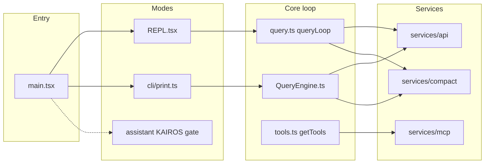

# Architecture overview

!!! warning "Recovered source"
Paths refer to `src/` in this repository. Line-level accuracy is best-effort from the source map reconstruction.

## High-level flow

## System design (deeper dives)

| Topic                             | Page                                                              |
| --------------------------------- | ----------------------------------------------------------------- |
| Layering and dependency direction | [Architectural layers](system-design/layers.md)                   |
| State, messages, and persistence  | [State and data flow](system-design/state-and-data-flow.md)       |
| Trust, permissions, MCP policy    | [Security and trust model](system-design/security-trust-model.md) |

## Short orientation

- **Entry** — `main.tsx`: Commander CLI, `preAction` (trust, settings, telemetry gates), side-effect imports (profiler, MDM, keychain prefetch).
- **Interactive host** — `replLauncher.tsx`, `screens/REPL.tsx`, `utils/queueProcessor.ts`.
- **Headless host** — `cli/print.ts`, `QueryEngine.ts`, `cli/structuredIO.ts`.
- **Tools & MCP** — `tools.ts`, `tools/*`, `services/mcp/`, `services/tools/`.
- **IDE / OS** — `bridge/`, `utils/deepLink/`, `utils/claudeInChrome/`.

## Key files (quick index)

| Path                                               | Role                                        |
| -------------------------------------------------- | ------------------------------------------- |
| `main.tsx`                                         | CLI entry, global options, `preAction`      |
| `screens/REPL.tsx`                                 | Interactive session core                    |
| `query.ts`                                         | Streaming query loop, tool round-trips      |
| `QueryEngine.ts`                                   | Headless query submission                   |
| `cli/print.ts`                                     | Print / stream-json / SDK control transport |
| `tools.ts` / `Tool.ts`                             | Tool registry and types                     |
| `services/api/client.ts`, `services/api/claude.ts` | HTTP / streaming API                        |
| `utils/permissions/`                               | Permission modes and prompts                |
| `services/compact/`                                | Compaction pipeline                         |
| `utils/sessionStart.ts`                            | Session / setup hooks                       |

## Further reading

- [Workflows](workflows.md) — end-to-end sequences.
- [Official docs map](official-docs-map.md) — product docs ↔ `src/`.
- [Reference](reference/cli-entry.md) — subsystem reference pages.
- [Glossary](appendix/glossary.md).
