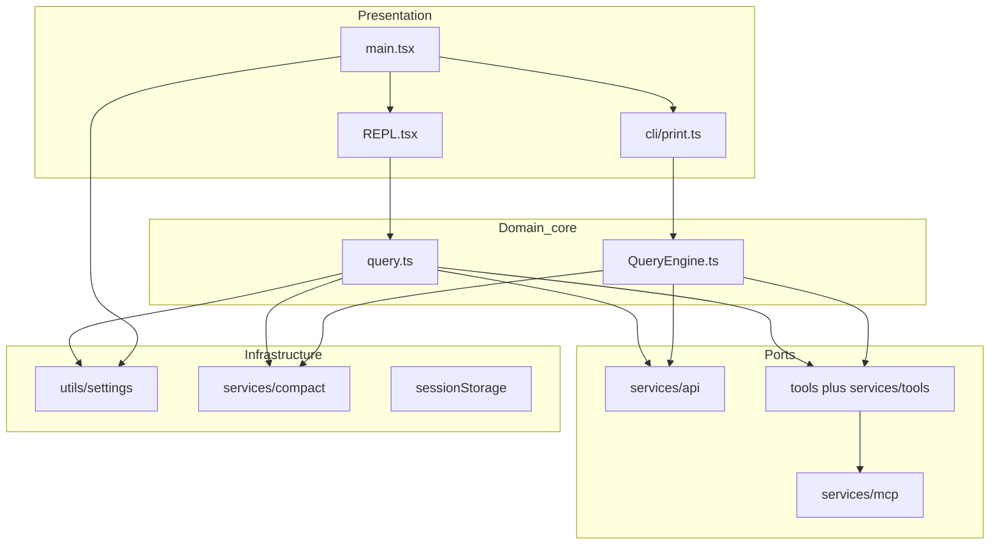

# Architectural layers

!!! warning "Recovered proprietary source"
Descriptions are for **study** of the `src/` mirror only. This is not an open-source distribution of Claude Code.

The Claude Code CLI is organized as **downward dependencies**: the shell and UI call into the query core and services; core logic does not depend on React/Ink components for correctness (headless paths prove that).

## Layer stack (conceptual)

| Layer                    | Responsibility                                               | Primary `src/` locations                                                                 |
| ------------------------ | ------------------------------------------------------------ | ---------------------------------------------------------------------------------------- |
| **CLI shell**            | argv parsing, global flags, subcommands, `preAction` startup | `main.tsx`, `commands/`, `cli/handlers/`                                                 |
| **Session host**         | Interactive TUI vs structured print/SDK transport            | `replLauncher.tsx`, `screens/REPL.tsx`, `cli/print.ts`, `cli/structuredIO.ts`            |
| **Query core**           | Turn loop, streaming, tool round-trips, context assembly     | `query.ts`, `QueryEngine.ts`, `utils/processUserInput/`                                  |
| **Transport**            | Anthropic (and provider) HTTP/streaming                      | `services/api/`                                                                          |
| **Tooling**              | Registry, execution, hooks                                   | `tools.ts`, `Tool.ts`, `tools/*`, `services/tools/`                                      |
| **Integrations**         | MCP, LSP, OAuth, IDE bridge                                  | `services/mcp/`, `services/lsp/`, `services/oauth/`, `bridge/`                           |
| **Policy & persistence** | Settings, compaction, session storage, telemetry             | `utils/settings/`, `services/compact/`, `utils/sessionStorage.ts`, `services/analytics/` |

## Dependency direction

**Rule of thumb:** `components/` and `ink/` sit under the REPL branch; `cli/print.ts` bypasses most of that stack but still shares `QueryEngine`, tools, API, and compaction.

## Feature gates

Some “layers” exist only in certain shipping builds: `assistant/` (KAIROS), `coordinator/` (`COORDINATOR_MODE`), voice (`VOICE_MODE`). See [Bun bundle and feature flags](../developer/bun-bundle-and-feature-flags.md).

## See also

- [State and data flow](state-and-data-flow.md)
- [Security and trust model](security-trust-model.md)
- [Architecture overview](../architecture.md)
