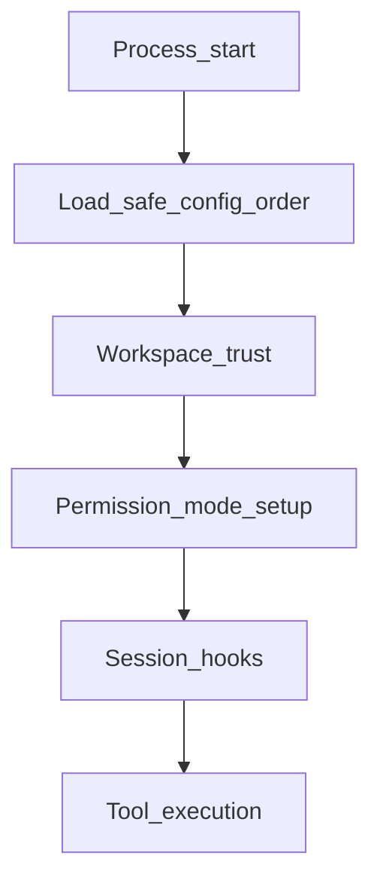

# Security and trust model

!!! warning "Recovered proprietary source"
This page summarizes **code structure**, not a formal security audit. Follow [official Security](https://code.claude.com/docs/en/security) and [Permissions](https://code.claude.com/docs/en/permissions) guidance for the product.

## Trust and workspace

Before destructive work runs, startup paths in `main.tsx` consult trust and workspace state (global config helpers under `utils/config.ts`, managed env under `utils/managedEnv.ts`). The intent is to avoid applying repo-supplied config or hooks until the user has acknowledged risk—public discussion of past ordering bugs is summarized in vendor advisories; always run an **up-to-date** official Claude Code build for production use.

## Permission modes

`utils/permissions/` defines modes (manual approval, auto with classifiers, plan-only variants, etc.). `permissionSetup.ts` and related modules:

- Parse CLI flags (`--permission-mode`, internal aliases).
- Strip or gate “dangerous” capabilities when using auto mode.
- Feed **always-allow** tool lists into `toolPermissionContext`.

User-facing reference: [Permission modes](https://code.claude.com/docs/en/permission-modes).

## Bash and sandboxing

Shell execution flows through `utils/shell/` (bash and PowerShell providers, output limits, read-only validation) and `tools/BashTool/`. Enterprise and product docs describe [Sandboxing](https://code.claude.com/docs/en/sandboxing) behavior; the source tree implements isolation and validation at the tool layer.

## MCP and enterprise policy

- **Config** — `services/mcp/config.ts` parses MCP server lists, env expansion, deduplication, and enterprise allowlists.
- **Channels** — `services/mcp/channelAllowlist.ts` and related modules gate inbound push notifications.

Official: [MCP](https://code.claude.com/docs/en/mcp), [Channels](https://code.claude.com/docs/en/channels).

## Hooks

User-defined hooks (session start, post-tool, etc.) are wired through `utils/sessionStart.ts` and related runners; they execute shell commands with the privileges of the CLI process. Treat untrusted projects as **untrusted code** until you understand hook content.

Official: [Hooks](https://code.claude.com/docs/en/hooks).

## Trust check order (conceptual)

Exact ordering evolves by version; correlate with `main.tsx` `preAction` and `entrypoints/init` when reading the mirror.

## See also

- [Permissions reference](../reference/permissions.md)
- [MCP reference](../reference/mcp.md)
- [Reproducibility and limits](../reproducibility.md)
