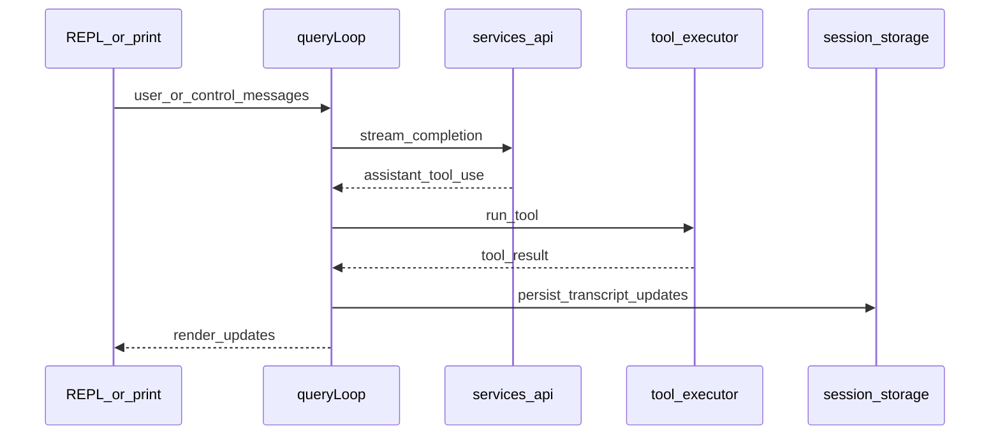

# State and data flow

!!! warning "Recovered proprietary source"
For authoritative product behavior, use [official Claude Code docs](https://code.claude.com/docs/en/overview).

## End-to-end message path (interactive)

1. **Input** — User text, slash commands, teammate notifications, or task items reach `screens/REPL.tsx`.
2. **Queue** — `utils/queueProcessor.ts` serializes or batches commands and calls `executeInput`.
3. **Query** — `query.ts` `queryLoop` streams the model, surfaces `tool_use` blocks, and applies permission checks using `toolPermissionContext` from app state.
4. **Execution** — `services/tools/` (e.g. `StreamingToolExecutor`, `toolExecution.ts`) dispatches to modules under `tools/*` or MCP-backed tools.
5. **Persistence** — Transcript updates, session metadata, and compaction boundaries flow through `utils/sessionStorage.ts`, conversation recovery helpers, and related hooks.

## State ownership

| Concern                 | Typical modules                                                                            |
| ----------------------- | ------------------------------------------------------------------------------------------ |
| **Global app state**    | `state/` (providers, stores such as `AppStateStore.ts`)                                    |
| **Context / stats**     | `context/`                                                                                 |
| **Messages**            | `utils/messages.ts`, message types under `types/message` (and generated types)             |
| **Permissions**         | `utils/permissions/`, fields on tool permission context updated from CLI and REPL          |
| **File / edit history** | Wired through process-user-input and tool hooks (see compaction and attribution utilities) |

## Simplified sequence (one turn)

## Headless differences

In print/SDK paths: `QueryEngine.ts` builds a `processUserInputContext` with `isNonInteractiveSession: true`, streams SDK-style messages, and bridges permission prompts over structured I/O instead of Ink dialogs. The **same** underlying message and tool model is reused.

## See also

- [Workflows](../workflows.md)
- [Query loop and streaming](../reference/query-engine.md)
- [Compaction](../reference/compaction.md)
