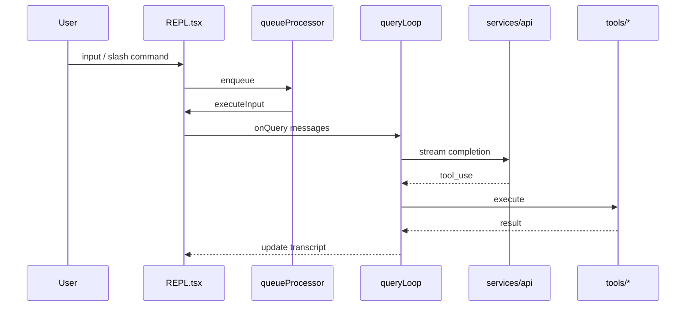

# End-to-end workflows

!!! warning "Recovered source"
Behavior described here is inferred from `src/`; the shipping product may differ by version or build flags.

## Interactive terminal session

1. **Process start** — `main.tsx` evaluates side-effect imports (profiler, MDM, keychain prefetch), then parses argv with Commander.
2. **`preAction` hook** — Trust dialog state, global config, remote-managed settings, policy limits, GrowthBook/feature flags, OAuth/API key paths, MCP official registry prefetch, plugin initialization, and similar steps run before the subcommand handler.
3. **REPL launch** — `replLauncher.tsx` creates the Ink root and renders providers (`AppState`, keybindings, MCP manager, etc.) and mounts `screens/REPL.tsx`.
4. **Input** — User typing, paste, voice (if `VOICE_MODE`), teammate messages, and task notifications enqueue work.
5. **Queue** — `utils/queueProcessor.ts` dequeues slash commands and bash lines individually; batches other same-mode items and calls `executeInput`.
6. **Query** — `query.ts` `queryLoop` streams model output, schedules tool calls, applies permission checks, and updates transcript state.
7. **Tools** — `services/tools/toolExecution.ts` / `StreamingToolExecutor` and per-tool modules under `tools/*` perform filesystem, shell, web, MCP, and agent operations.
8. **Compaction** — When context limits approach, `services/compact/*` reduces history per compaction policy.

**Official parallels:** [Interactive mode](https://code.claude.com/docs/en/interactive-mode), [How Claude Code works](https://code.claude.com/docs/en/how-claude-code-works).

## Print mode / stream-json / programmatic control

1. **Routing** — `main.tsx` selects the print/headless path instead of the full REPL when `-p` / related flags are used.
2. **Structured I/O** — `cli/structuredIO.ts` parses lines into typed events; `cli/print.ts` `runHeadlessStreaming` runs the async loop that consumes user/control messages and emits stdout messages.
3. **Engine** — `QueryEngine.submitMessage` builds `processUserInputContext` for non-interactive sessions and streams SDK-style messages.

**Official parallels:** [Run Claude Code programmatically](https://code.claude.com/docs/en/headless), [Agent SDK overview](https://platform.claude.com/docs/en/agent-sdk/overview) (external platform docs).

## Teammates / agent teams

1. **Spawn** — Swarm backends (`utils/swarm/backends/*`) create tmux panes, iTerm panes, or in-process runners.
2. **Teammate loop** — `utils/swarm/inProcessRunner.ts` runs a `while` loop: build prompt messages, check compaction/token limits, call into shared query/tool paths, sync permissions via `leaderPermissionBridge`, etc.
3. **REPL integration** — `REPL.tsx` wires `useInboxPoller`, `useMailboxBridge`, and `handleIncomingPrompt` so teammate messages become user turns.

**Official parallels:** [Agent teams](https://code.claude.com/docs/en/agent-teams), [Subagents](https://code.claude.com/docs/en/sub-agents).

## Hooks (user-configured)

1. **Session start** — `utils/sessionStart.ts` `processSessionStartHooks` / `processSetupHooks` run after configuration is known; wired from startup paths in `main.tsx` and related modules.
2. **Per-event hooks** — Additional hook types align with the schema described in the official [Hooks reference](https://code.claude.com/docs/en/hooks); implementation is spread across hook runners and tool lifecycle code.

**Official parallels:** [Hooks guide](https://code.claude.com/docs/en/hooks-guide), [Hooks reference](https://code.claude.com/docs/en/hooks).

## Compaction and context

1. **Triggers** — Token estimation and session memory modules decide when to compact.
2. **Pipeline** — `services/compact/compact.ts`, `autoCompact.ts`, `microCompact.ts`, and related files rewrite or summarize message history.
3. **Post-compact** — Cleanup hooks update UI and storage.

**Official parallels:** [Context window](https://code.claude.com/docs/en/context-window), [Checkpointing](https://code.claude.com/docs/en/checkpointing), [Costs](https://code.claude.com/docs/en/costs).

## MCP and external tools

1. **Config** — `services/mcp/config.ts`, env expansion, enterprise allowlists.
2. **Connection** — `MCPConnectionManager.tsx`, stdio and SDK transports.
3. **Tool surface** — `tools/MCPTool`, `ReadMcpResourceTool`, `ListMcpResourcesTool`, `McpAuthTool`.

**Official parallels:** [MCP](https://code.claude.com/docs/en/mcp), [Channels](https://code.claude.com/docs/en/channels).

## Optional sequence (interactive turn)

## See also

- [Architecture overview](architecture.md)
- [State and data flow](system-design/state-and-data-flow.md)
- [Official docs map](official-docs-map.md)
